以下将严格按照“**阿里云服务器 + VSCode SSH + LLaMA-Factory Web UI**”的流程，一步一步来，你只需要复制粘贴命令和点击按钮即可完成LLAMA-Factory的Web UI界面微调的学习。

注意，这是一个可以**直接跟着执行**的保姆级教程。

-----

### 阶段 0：购买与配置阿里云服务器 (ECS)

这是最关键的第一步，请务必仔细操作。

1.  **注册与登录：**

      * 访问[阿里云官网](https://www.aliyun.com/)并完成注册和实名认证。
      * 注意，微调使用huggingface要使用国外的节点，国内防火墙很麻烦。使用国内镜像的话又可能会造成版本不一致产生错误的麻烦问题。

      那么，你可以选择使用阿里云国际站，也可选择国内的。选择国际站难点在于你需要使用护照或者驾驶证进行验证。使用国内版本的阿里云，你需要特别注意**选择国外网点**，因为这会大大简化依赖包版本不匹配的问题。

2.  **进入 ECS 控制台：**

      * 登录后，在顶部搜索框搜索“**ECS**”（即“云服务器 ECS”），点击进入控制台。
      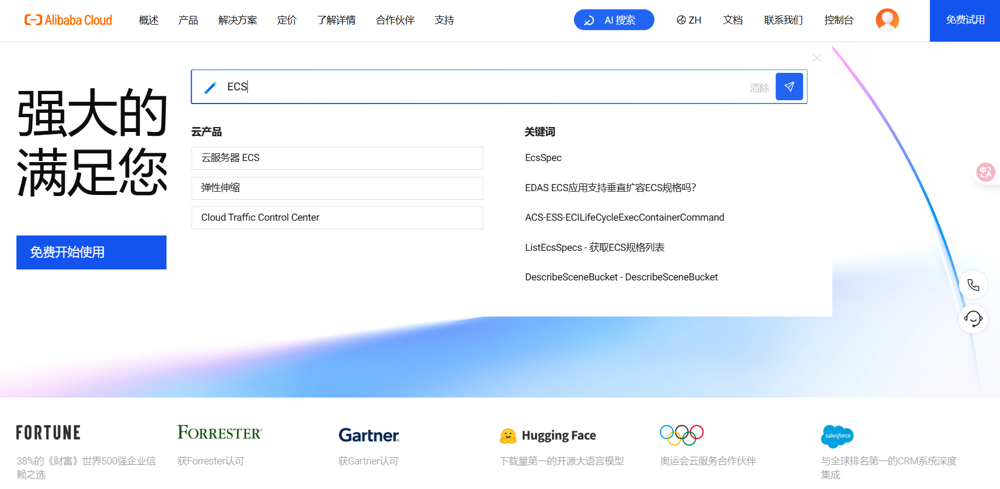


3.  **创建实例（买服务器）：**

      * 在 ECS 概览页面，点击“**创建实例**”。
      

4.  **详细配置（关键步骤）：**

      * **计费方式：** 选择“**按量付费**”。（**非常重要！** 这样你不用的时候关机就不扣费，成本最低）。

      * **地域：** 选择“**香港**”。

      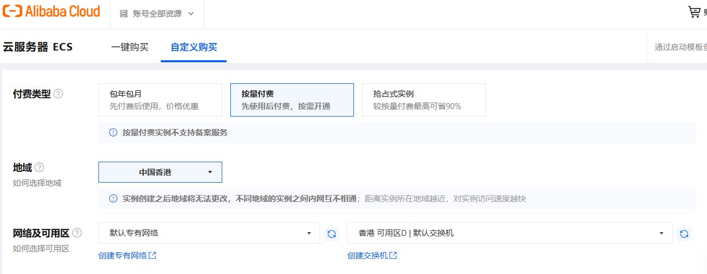

      * **实例规格：**
          * 点击“**实例规格**”旁的“**选择**”。
          * 在弹出的窗口中，左侧导航栏找到“**GPU 计算型**”。
          * **新手推荐 (T4)：** 选择 `ecs.gn6i-c8g1.2xlarge` (8 vCPU, 32 GiB 内存, 1 \* NVIDIA T4 16GB 显存)。这个性价比最高，适合入门。
          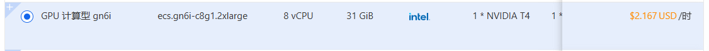
          * **进阶推荐 (A10)：** 选择 `ecs.gn7i-c8g1.2xlarge` (8 vCPU, 31 GiB 内存, 1 \* NVIDIA A10 24GB 显存)。这个性能更好，可以跑更大的模型。


          * 如果某个地区没有某个类别的服务器，可以查看还有哪些较近的地区。
          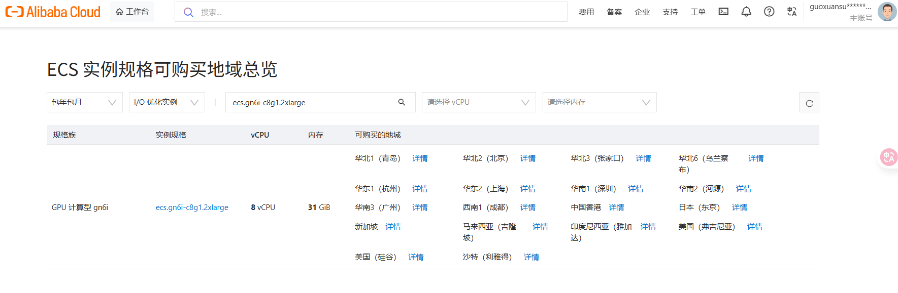

          * 选择一个后，点击“**选定**”。
      * **镜像 (操作系统)：**
          * 这是**最关键**的一步。点击“**镜像**”旁的“**选择**”。
          * 选择“**公共镜像**”。
          * **操作系统：** 选择 `Ubuntu`。
          * **版本：** 选择 `22.04` 或 `20.04`。
          * **关键：** 要安装CUDA和cuDNN.
          * 例如：`Ubuntu 22.04 64位 + CUDA 12.1` 或 `Ubuntu 20.04 64位 + CUDA 11.8`。这会帮你省去安装 GPU 驱动的巨大麻烦。
          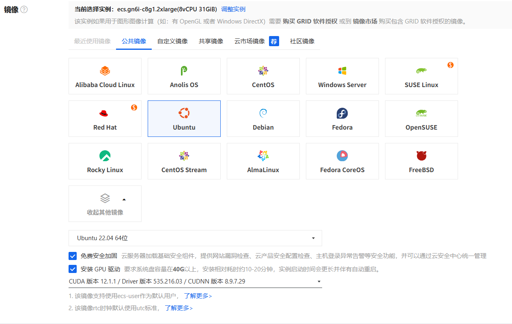
          * 点击“**选定**”。
      * **存储：** 系统盘默认即可，不需要数据盘。
            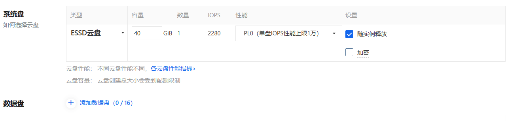
      * **网络与安全组：**
          * 网络默认的“专有网络”即可。
          * **公网 IP：** 必须勾选“**分配公网 IPv4 地址**”。
          * **安全组：** 点击“**新建安全组**”。
              * 在“规则”里，确保 **22 端口** 是开放的（用于 SSH）。默认就是开放的。
              * （备注：我们稍后使用 VSCode 的端口转发功能，所以你**不需要**在这里开放 7860 端口，更安全。）
              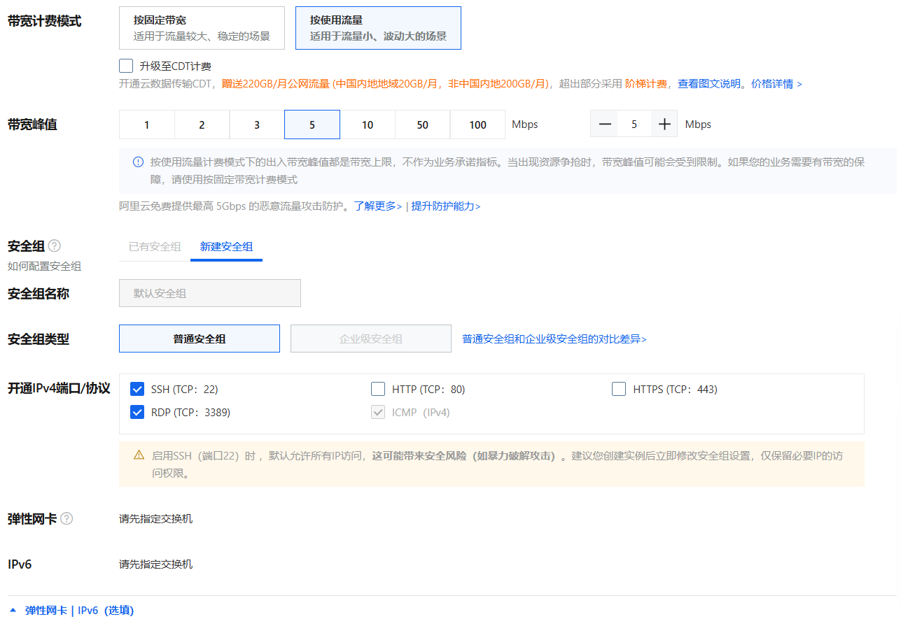
      * **登录凭证：**
          * **登录凭证：** 选择“**密钥对**”。
          * 点击“**新建密钥对**”。
          * **密钥对名称：** 随便起一个，比如 `LLAMA-Factory-Web-UI`。
          * **创建方式：** 选择“**自动新建密钥对**”。
          * 点击“**确定创建**”。浏览器会自动下载一个 `.pem` 文件（例如 `my-gpu-key.pem`）。
          * **保存好这个文件！** 它是你登录的唯一钥匙，丢了就登不上了。
          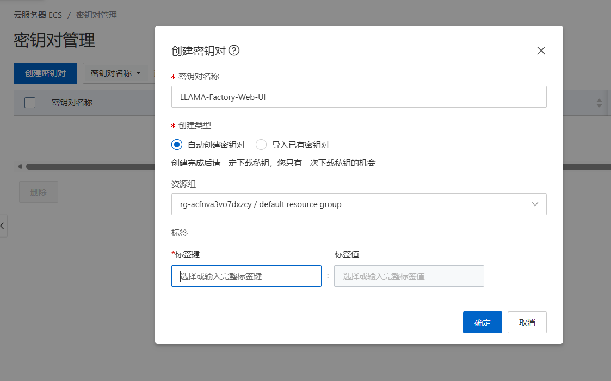
          ```
            你看到的 标签键 和 标签值 是阿里云用来帮你分类资源（比如给服务器打个“开发中”或“生产中”的标签），它不影响任何功能。

            这里你随便填一个就可以通过验证了。

            建议你这样填：

            标签键：输入 purpose （或者中文 用途）

            标签值：输入 llama-factory
          ```
          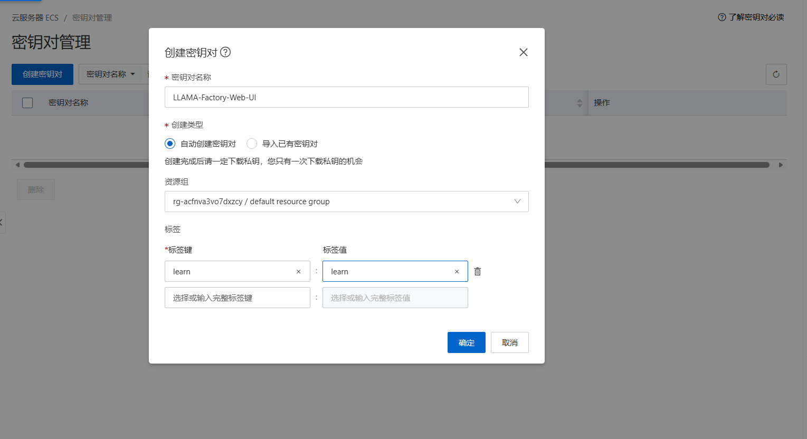
          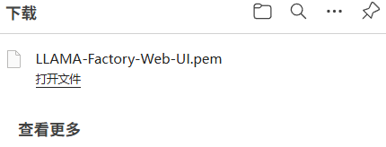
          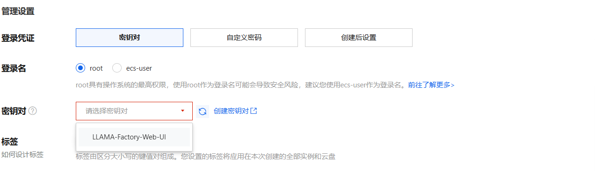
          
      * **确认订单：**
          * 勾选“我已阅读并同意...”。
          * 点击“**创建实例**”。
            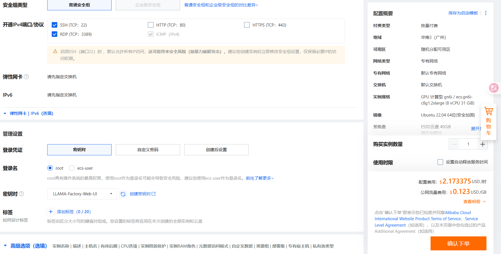
5.  **查看你的服务器 IP：**

      * 等待 1-3 分钟，服务器创建成功。
      * 在“实例列表”中找到你的新服务器，复制它旁边的“**公网 IP**”地址。

-----

### 阶段 1：使用 VSCode 连接服务器

1.  **本地安装 VSCode：**

      * 如果还没有，去 [VSCode 官网](https://code.visualstudio.com/) 下载并安装。

2.  **安装 SSH 插件：**

      * 打开 VSCode，点击左侧的“扩展”图标 (四个方块)。
      * 搜索 `Remote - SSH`，点击第一个（微软官方出品），安装它。

3.  **配置 SSH 连接：**

      * 安装后，按 `F1` 键 (或者 `Ctrl+Shift+P`) 打开命令面板。
      * 输入 `Remote-SSH: Open Configuration File...`，回车。
      * 选择第一个文件，通常是 `.../.ssh/config`，打开它。
      * 在文件末尾，粘贴以下内容，并**替换**为你自己的信息：

    <!-- end list -->

    ```conf
    Host LLAMA-Factory-GZ  # 你给服务器起的别名，随便填
      HostName 你的公网ip
      User root     # 阿里云的 Ubuntu 镜像默认是 root 用户
      IdentityFile 这里是你刚才下载的 .pem 文件的完整路径
      # 这里替换成你刚才下载的 .pem 文件的【完整路径】，注意，一定要放在系统盘，例如C盘，因为后续要调整权限问题。
                                                # Windows 示例: C:/Users/你的用户名/Downloads/my-gpu-key.pem
                                                # Mac/Linux 示例: /Users/你的用户名/Downloads/my-gpu-key.pem
    ```
      * **注意：** Windows 路径请使用 `/` 而不是 `\`。
      * 保存并关闭这个 `config` 文件。

4. **调整pem文件权限**

    * 打开所在的地址。
    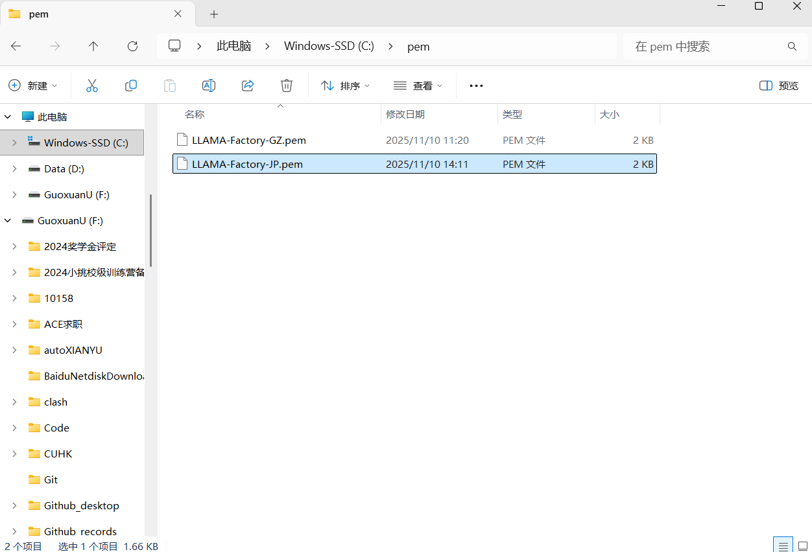
    
    * 点击高级。
    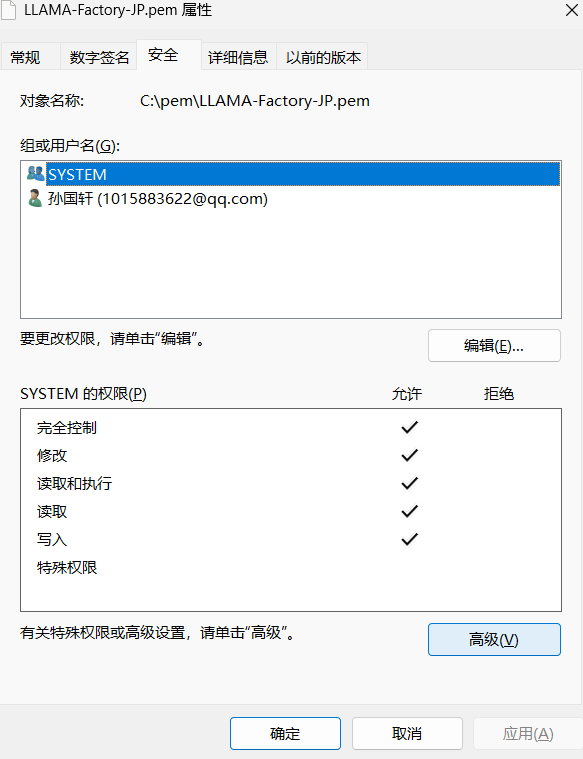 

    * 点击启用继承，选择第一个清除掉所有的用户的继承关系。
    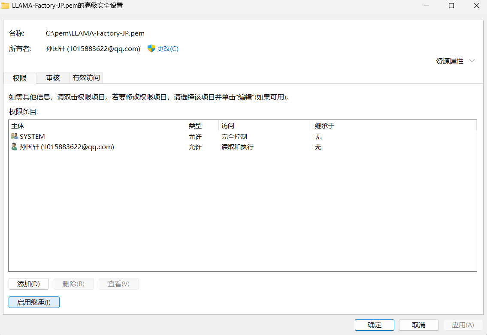

    * 添加你这个主题。
    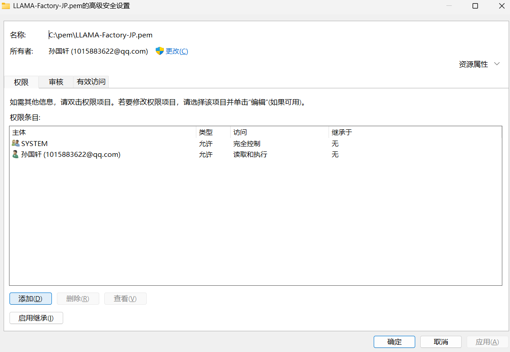

    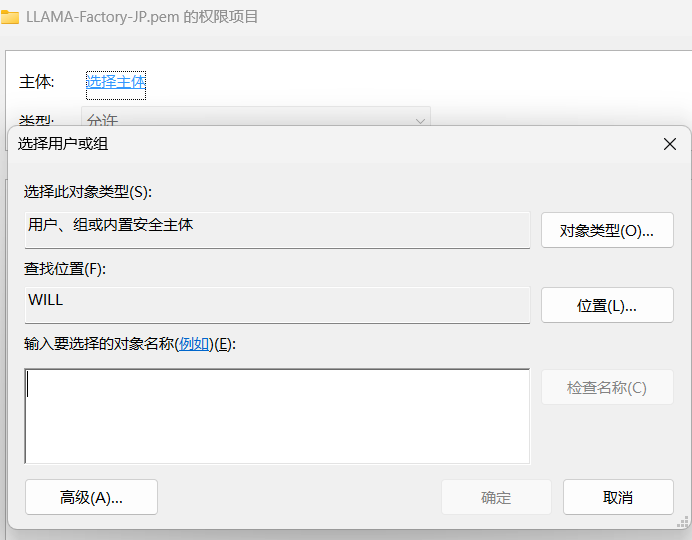
    把你的用户添加进去。

    * 最后变成这样。
    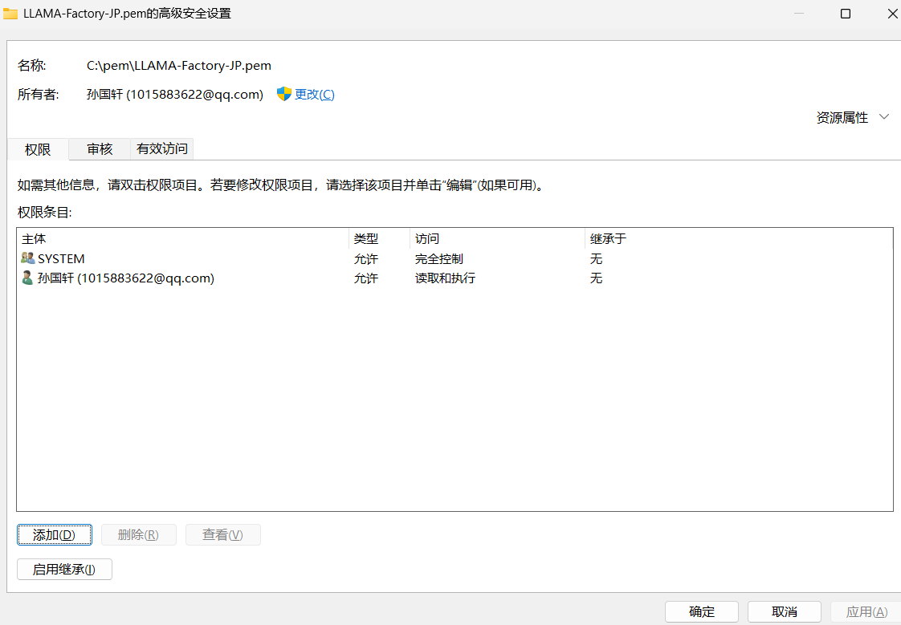

5.  **连接！**

      * 点击 VSCode 左下角的绿色 `><` 图标。
      * 在弹出的菜单中，选择 `Remote-SSH: Connect to Host...`
      * 选择你刚才配置的 `LLAMA-Factory-GZ`。
      * VSCode 会打开一个新窗口，并开始连接。第一次连接会询问你系统平台（选 `Linux`）和是否信任（选 `Continue`）。
      * 连接成功后，VSCode 的左下角会显示 `SSH: aliyun-gpu`。

### 阶段 2：在服务器上安装 LLaMA-Factory

你现在的所有操作都是在你的阿里云服务器上。

1.  **打开 VSCode 终端：**

      * 在 VSCode 菜单栏选择 `Terminal -> New Terminal`。

2.  **检查 GPU（定心丸）：**

      * 在终端里输入：

    <!-- end list -->

    ```bash
    nvidia-smi
    ```

      * 你应该能看到一块 NVIDIA T4 (或 A10) 的信息。这表示 GPU 一切正常。

      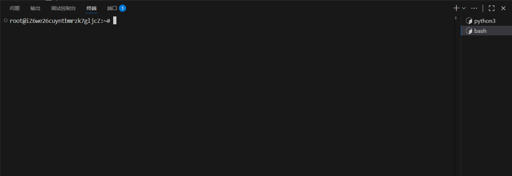

3.  **安装依赖环境：**

      * 复制并粘贴以下命令，一次性执行：

    <!-- end list -->

    ```bash
    # 更新包列表
    apt update
    # 安装 git, python3-pip 和 python3-venv
    apt install git python3-pip python3-venv -y
    ```

    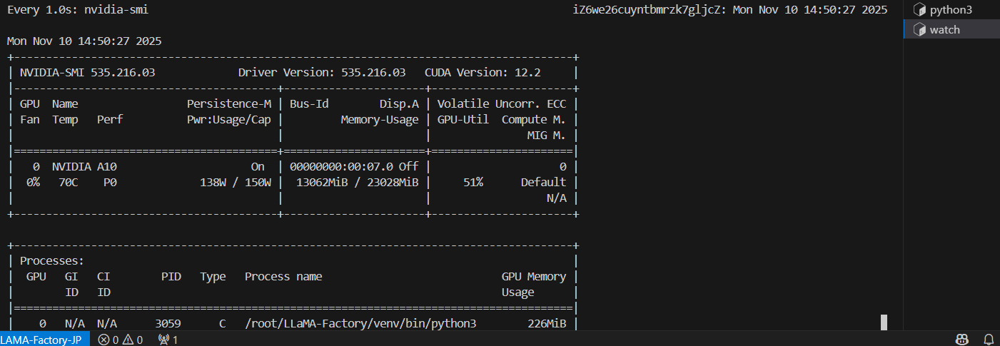

    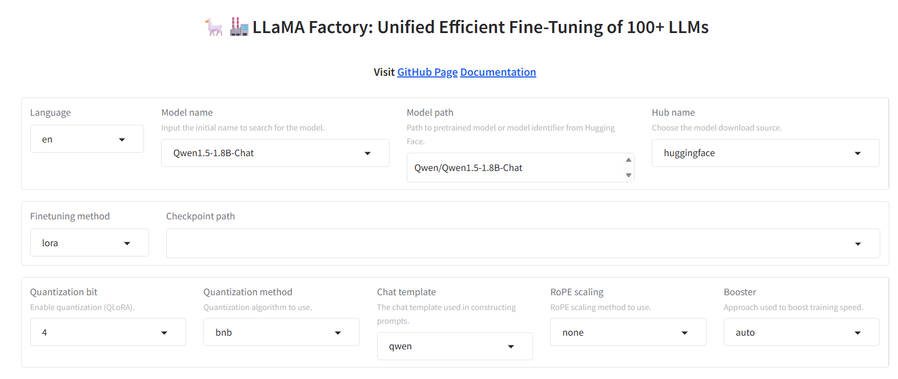


4.  **下载 LLaMA-Factory：**

      * `cd /root` (进入你的主目录)
      * `git clone https://github.com/hiyouga/LLaMA-Factory.git`

      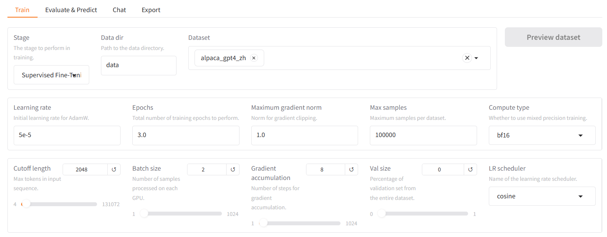

5.  **安装 LLaMA-Factory：**

    ```bash
    # 1. 进入刚刚下载的目录
    cd LLaMA-Factory

    # 2. 创建一个 Python 虚拟环境，命名为 venv
    python3 -m venv venv

    # 3. 激活这个虚拟环境 (非常重要！)
    source venv/bin/activate
    # (激活后，你的命令行前面会多一个 (venv) 标记)


    # 4. 安装 LLaMA-Factory 核心依赖和 4-bit 量化支持
    pip install -e .[torch,bitsandbytes]
    ```
    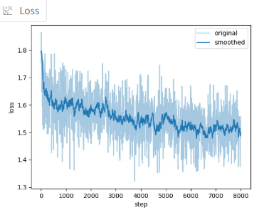

    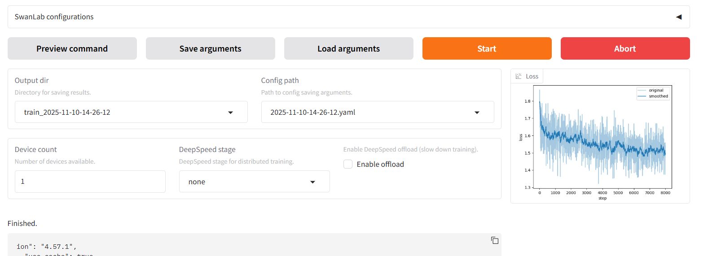

### 阶段 3：运行 LLaMA-Factory Web UI 并实战微调

1.  **启动 Web UI：**

      * 确保你仍处于 `LLaMA-Factory` 目录且 `(venv)` 虚拟环境已激活。
      * 在 VSCode 终端中运行：

    <!-- end list -->

    ```bash
    CUDA_VISIBLE_DEVICES=0 llamafactory-cli webui
    ```

      * 终端会开始运行，并显示 `Running on local URL: http://127.0.0.1:7860`。

      运行之后可能会直接在你的本地弹出浏览器界面：
      

      这时候你就不用进行2. 访问 Web UI (VSCode 端口转发)的任务了。

2.  **访问 Web UI (VSCode 端口转发)：**

      * **不要**在你的本地浏览器打开 `127.0.0.1:7860`（那是无效的）。
      * 在 VSCode 窗口中，找到“**端口 (Ports)**”标签页（它和“终端”在同一个面板）。
      * 点击“**转发端口 (Forward a Port)**”。
      * 输入 `7860`，回车。
      * VSCode 会自动为你设置好转发。在“端口”列表里，`7860` 端口后面会出现一个“**在浏览器中打开 (Open in Browser)**”的小地球图标。
      * **点击这个小地球图标！**
      * VSCode 会在你的**本地浏览器**中打开一个 `http://localhost:7860` 的地址。
      * **成功！** 你现在看到了 LLaMA-Factory 的 Web UI 界面。

3.  **执行 SFT 微调任务 (Qwen1.5-1.8B)**

    在你的本地浏览器打开的 Web UI 界面上，按顺序点击设置：

      * **(1) Model (模型) 标签页：**

          * `Model name (模型名称)`: 从下拉框中选择 `Qwen/Qwen1.5-1.8B-Chat`。（它会在运行时自动下载）
          * `Finetuning method (微调方法)`: 选择 `lora`。
          * `Quantization (量化)`: 选择 `4-bit`。（这是 QLoRA，极大节省显存）

      * **(2) Dataset (数据集) 标签页：**

          * 在 `Dataset (数据集)` 下拉框中，找到并勾选 `alpaca_gpt4_zh` (一个常用的中文指令数据集)。
          * （你可以点一下 `Preview dataset` 预览数据格式）

      * **(3) Hyperparams (参数) 标签页：**

          * `Epochs (训练轮数)`: 设为 `3.0`。
          * `Batch size (批处理大小)`: 设为 `2`。（如果你的显存是 T4 16GB，2 是绝对安全的值）。
          * `Learning rate (学习率)`: 保持默认的 `5e-5` 即可。

      * **(4) Run (运行) 标签页：**

          * `Output directory (输出目录)`: 没有办法自己设置。
          Output dir
          Directory for saving results：
          train_2025-11-10-12-36-55
          Config path
          Path to config saving arguments：
          2025-11-10-12-36-55.yaml

          * **点击 `Start` 按钮！**

4.  **监控训练：**


      * **看 Web UI：** 界面下方的 `Logs (日志)` 框会开始滚动。首先它会下载模型，然后开始训练，你会看到进度条和 `Loss` (损失) 值出现。

    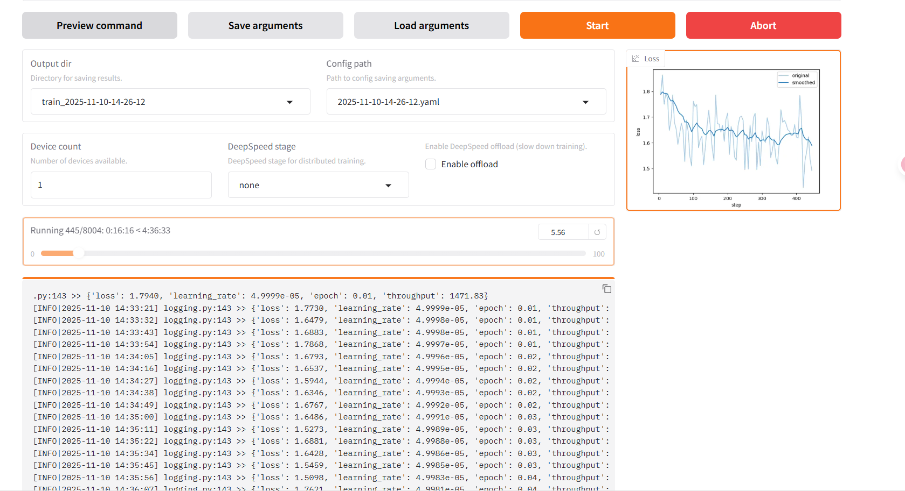

      * **看 GPU (推荐)：** 在 VSCode 里，点击终端面板右上角的 `+` 号，**新开一个终端**。
      
          * 在新终端里输入 `watch -n 1 nvidia-smi` (每秒刷新一次 `nvidia-smi`)。
          * 你将看到 GPU 的 `Volatile GPU-Util` (GPU使用率) 飙升到 90% 以上，`Memory-Usage` (显存占用) 也会很高。这证明你的 GPU 正在全力“炼丹”！
          
      * 根据 T4 的性能，这个 1.8B 模型的训练任务大概需要 15-30 分钟。

    解释一下这个监控图：
    ```

    ### 📈 关键指标解读

    1.  **`Process name: .../LLaMA-Factory/venv/bin/python3`**
        * **含义：** 在下方的“进程”表里，你可以看到 `python3` 正在运行，它正是 LLaMA-Factory 的主程序。

    2.  **`GPU Name: NVIDIA A10`**
        * **含义：** 你使用的是 A10 GPU，这比教程中的 T4 更强，拥有 24GB 显存（图上显示为 23028MiB）。

    3.  **`Pwr:Usage/Cap: 141W / 150W`**
        * **含义：** 这是**最重要的信号！** 你的 GPU 正在消耗 141 瓦的电力，已经**接近其 150 瓦的功率上限**。这表明 GPU 正在全力工作。

    4.  **`Perf: P0`**
        * **含义：** `P0` 状态代表“最高性能”。你的 GPU 已经火力全开。

    5.  **`Memory-Usage: 13062MiB / 23028MiB`**
        * **含义：** 你的程序已经占用了 13GB 的显存。这包括：
            * 4-bit 量化后的 `Qwen-1.8B` 模型。
            * LoRA 适配器参数。
            * 优化器状态（比如 AdamW）。
            * 当前正在处理的数据批次 (`Batch size: 2`)。
        * 占用 13GB 显存是**完全正常**的，说明模型和数据都已成功加载。

    ---

    ❓ 常见疑问：为什么 GPU-Util (使用率) 只有 35%？

    你可能在想，教程里说会飙到 90%，为什么我这里只有 35%？

    **回答：这是完全正常的。**

    `GPU-Util` 显示的是**计算核心**的使用率。在训练时，GPU 不仅仅在“计算”，它还在“等待数据”。

    在你的任务中（`Batch size: 2`），GPU (A10) 的计算速度**非常快**，而 CPU 准备下一批数据（读取、分词、打包）的速度相对较慢。

    这会导致一个常见的“瓶颈”现象：
    1.  CPU 把一批数据（batch 1）交给 GPU。
    2.  GPU **瞬间** (比如 0.1 秒) 完成计算 (Util 飙到 100%)。
    3.  GPU **等待** (比如 0.2 秒) CPU 把下一批数据（batch 2）准备好 (Util 降到 0%)。
    4.  `nvidia-smi` 每秒刷新一次，它看到的只是这个过程的*平均值*（(100% * 0.1s + 0% * 0.2s) / 0.3s ≈ 33%）。

    **总结：**
    不要看 `GPU-Util`，**请看 `Pwr:Usage` (功率)**。你的功率 (141W) 已经跑满了，这证明 GPU 正在全力工作。

    ---

    ### ✅ 结论

    一切顺利。你现在只需要：

    1.  **回到 LLaMA-Factory 的 Web UI 浏览器页面。**
    2.  查看下方的 `Logs (日志)` 框。
    3.  你很快就会看到**训练进度条**开始滚动，显示 `Step`、`Loss` (损失值) 和 `Epoch` (轮数)。

    恭喜你，你已经成功开始了你的第一次微调！
    ```

我这里记录这个任务所需要的具体的时间：
    开始：[INFO|2025-11-10 14:27:30]
    结束：

我这个任务的具体的参数是：
    
    

-----

### 阶段 4：测试与导出你训练的模型

训练完成后，日志会显示 "Finetuning finished."。


1.  **在线聊天测试：**

    首先你需要去加载一个检查点，这记录了你最优模型的位置。然后点load model。
    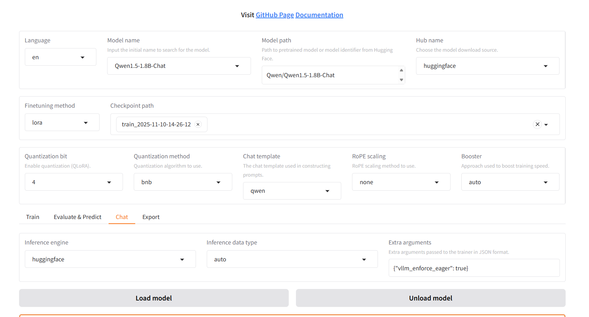
    
    这就是你微调之后的模型。

    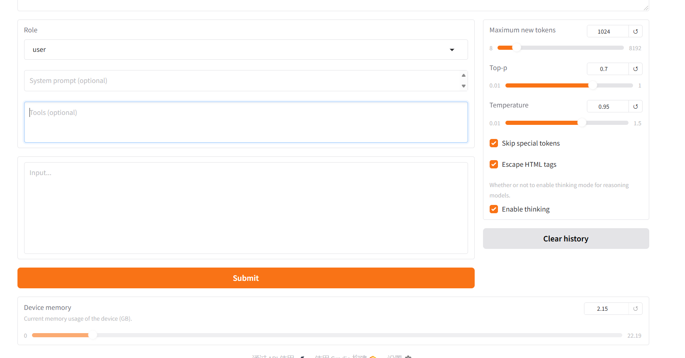

    让我们来进行几次测试：

    期望的差别（微调前 vs 微调后）：
    微调前 (Base Qwen-Chat)： 作为通义千问，它已经能回答你的问题。但它的回答可能是常规的聊天风格，比如一段话，或者一个简单的列表，不一定会严格遵守你设定的“数量”或“格式”要求。

    微调后 (你训练的模型)： 你的模型被 alpaca_gpt4_zh (GPT-4 级别的数据) “教导”过，它应该更严格地遵守指令的结构。当你要求“三点”时，它会非常精确地给出三点，并且格式工整（比如使用 1. 2. 3.），回答的质量也应该更高。

    微调前：
    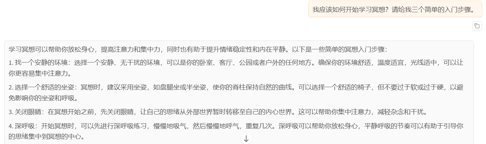
    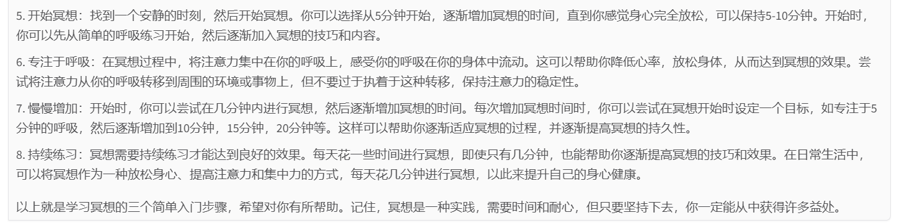

    微调后：
    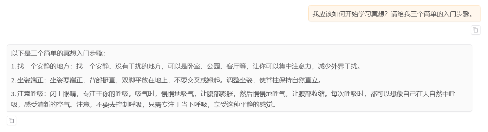

2.  **导出完整模型：**

    导出模型的正确步骤：

    请你现在按照以下步骤，在你的 `Export` 页面上**补全设置**即可：

    1.  **`Model name`**: `Qwen1.5-1.8B-Chat`
    2.  `Hub name`: `huggingface`
    3.  `Finetuning method`: `lora`

    4.  **【关键步骤 1：选择你的补丁】**
        * 在 `Finetuning method` 下方，找到 **`Checkpoint path`** (检查点路径) 这个**下拉框**。
        * **点击它**。
        * 在弹出的列表中，**勾选**你刚刚训练好的那个适配器（补丁），它的名字应该类似于 `train_2025-11-10_14-51-09`（即你训练时 `Output dir` 的名字）。
        * *（这就是教程中所说的 `Adapter path`）*

    5.  **【关键步骤 2：命名你的模型】**
        * 找到 **`Export dir`** (导出目录) 这个**输入框**。
        * **在框里输入一个名字**，比如教程中推荐的：`my_first_merged_model`

    6.  **【最后一步：开始导出】**
        * **点击**页面中间那个大大的、灰色的 **`Export`** 按钮。
        * *（这就是教程中所说的 `Start` 按钮）*
        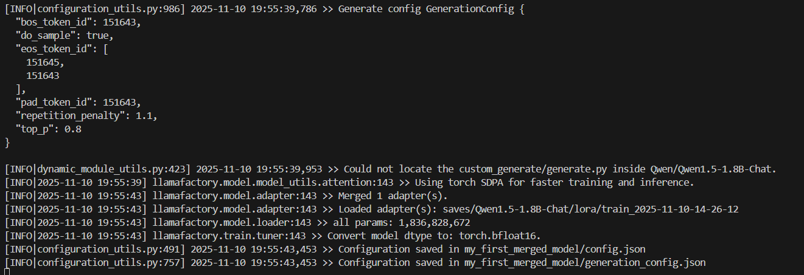

    注意，你可能会遇到空间不够的情况，请你新开一个终端，执行下面的命令来清除缓存：
    ```bash
    # 1. 清理 apt 软件包缓存
    apt-get clean

    # 2. 清理 pip 库缓存
    pip cache purge
    ```

    接下来会发生什么？

    * 点击 `Export` 后，请**回到你的 VSCode 终端**查看**日志**。
    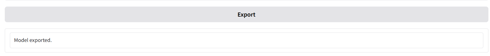
    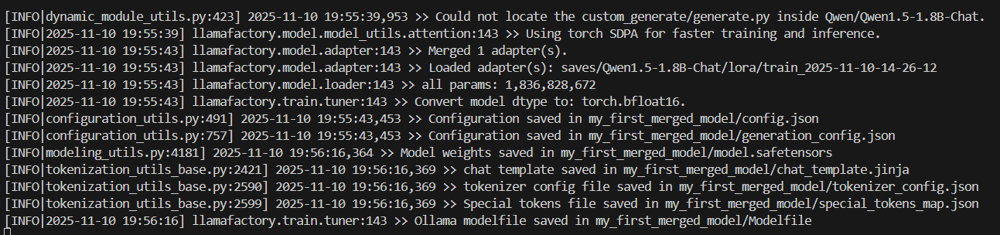
    * 你会看到 LLaMA-Factory 开始加载基础模型（Qwen），然后加载你的 LoRA 补丁，将它们合并，最后保存到你指定的 `my_first_merged_model` 文件夹中。
    * 这个过程会占用一些时间。当日志显示完成后，你就可以在 VSCode 左侧的文件浏览器中看到你导出的完整模型了！

    * 如何找到这个下载下来的模型：
        * 你需要打开文件夹，点击创建的LLAMA-Facytory这个文件夹。
        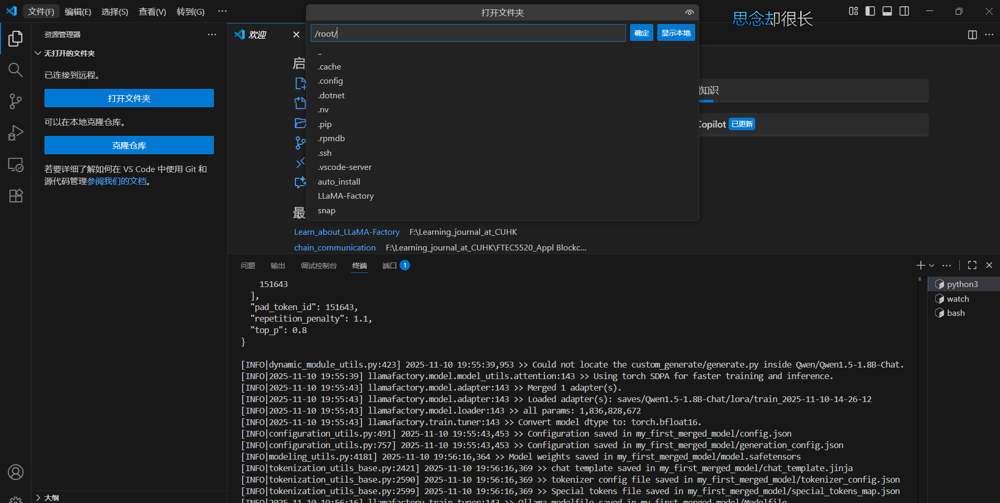
        * 进入一个新的界面。
        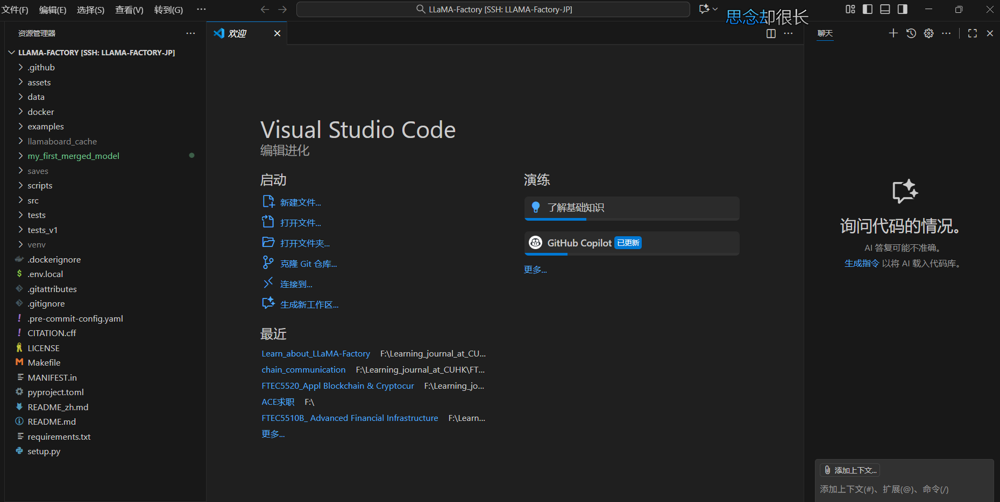
        * 找到我们刚刚保存的那个微调后的模型，右键点击，然后点击下载，就可以下载在本地了。
        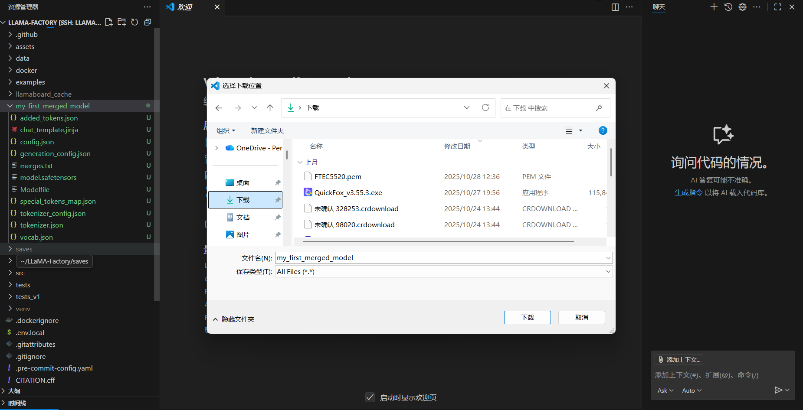


-----

### 阶段 5：清理战场（非常重要！）

1.  **停止 Web UI：**

      * 在 VSCode 里运行 `llamafactory-cli webui` 的那个终端里，按 `Ctrl + C` 来停止服务。
      

2.  **停止服务器（省钱！）：**

      * **回到阿里云 ECS 控制台。**
      * 找到你的实例，点击“**操作**” -\> “**停止**”。
      * **一定要选择“停止”而不是“重启”！**
      * （注意：停止后保留实例，系统盘还是会收很小一笔存储费，但 GPU 和 CPU 的大头费用就停止了。如果你确定几天内都不用了，可以选择“**释放**”，这会彻底删除服务器。）
      * 你可以给释放掉。
      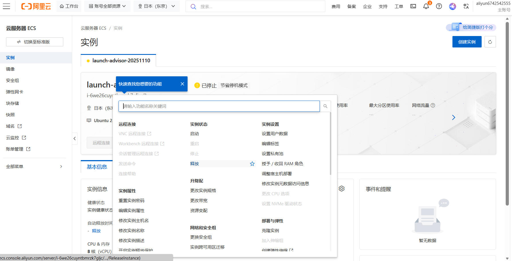

恭喜你！你已经完整地跑通了在云服务器上微调 AI 大模型的全过程！